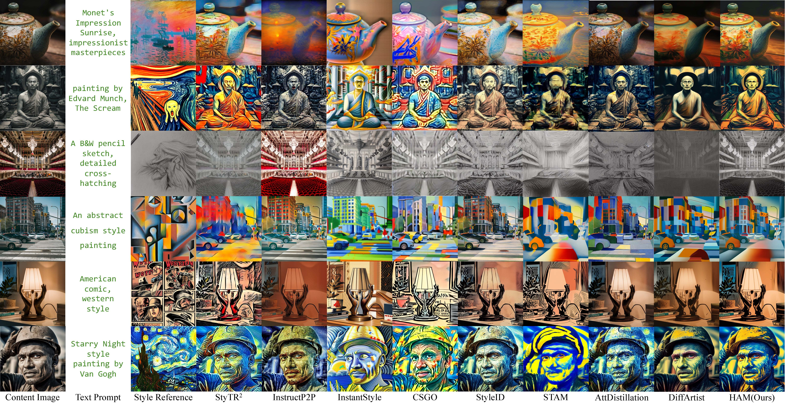

<div align="center">

# 🎨 HAM: Heterogeneous Attention Modulation

### A Training-Free Style Transfer Approach for Diffusion Models

[](https://openaccess.thecvf.com/content/CVPR2026F/html/He_HAM_A_Training-Free_Style_Transfer_Approach_via_Heterogeneous_Attention_Modulation_CVPRF_2026_paper.html)
[](https://arxiv.org/abs/2603.24043)
[](LICENSE)
</div>

---

## 📢 News

- **2026.02** 🎉 HAM is accepted to **CVPR 2026 Findings**!
- Code will be released soon — stay tuned!

---

## 📖 Overview

<div align="center">

</div>

**HAM (Heterogeneous Attention Modulation)** is a **training-free** style transfer framework built on diffusion models.

---

## 🚀 Quick Start

> ⚠️ **Code is coming soon.** The instructions below will be updated with exact commands upon release.

```bash
# Clone the repository
git clone https://github.com/larryhyq/HAM.git
cd HAM

# Install dependencies
pip install -r requirements.txt

# Run style transfer
bash run-main.sh
```

### Requirements

See [requirements.txt](requirements.txt) for the full list. Core dependencies:

- `diffusers ≥ 0.37.1`, `transformers ≥ 4.51.3`
- `torch ≥ 2.5.1`, `torchvision ≥ 0.20.1`
- `einops`, `omegaconf`, `requests`, `tqdm`, `wandb`
- `numpy`, `pandas`, `matplotlib`, `scikit-learn`, `scipy`

---

## 📝 Citation

If you find HAM useful in your research, please consider citing:

```bibtex
@inproceedings{he2026ham,
  title     = {HAM: A Training-Free Style Transfer Approach via Heterogeneous 
               Attention Modulation for Diffusion Models},
  author    = {He, Yeqi and Li, Liang and Yang, Zhiwen and Sheng, Xichun and 
               Zhao, Zhidong and Yan, Chenggang},
  booktitle = {Proceedings of the IEEE/CVF Conference on Computer Vision 
               and Pattern Recognition (CVPR)},
  pages     = {3914--3923},
  year      = {2026}
}
```

---

## 📄 License

This project is released under the [MIT License](LICENSE).

---